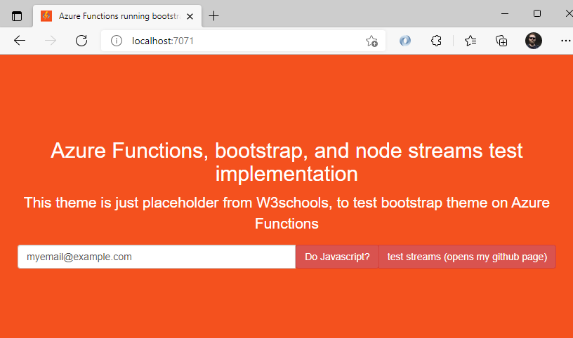

# Azure Functions custom handler demo for express

## Solution description
This is just a demo solution. I wrote earlier a blog about customHandlers if you are interested to know more about them
https://securecloud.blog/2021/01/04/express-js-middlewares-on-azure-functions-via-custom-handlers/

**Why did I test this?**

- I am spoiled by the pricing model of Azure Functions, thus I wanted to have Consumption based web app for very simple implementations (site load is billed per consumption pricing for functions, in theory with lot of siteloads, this could also become more costly) 
- I wanted to test streaming implementation using Azure Functions there is router [/stream](azapp/routes/stream.js) in the project

Is this supported? (or better, is it recommended 😎 ?) That depends alot. For anything in production I would use different services (Azure App service, Azure Container Apps, Azure Static Web apps etc)



## Disclaimer
Read [License](#license)


## Table of contents
- [Azure Functions custom handler demo for express](#azure-functions-custom-handler-demo-for-express)
  - [Solution description](#solution-description)
  - [Disclaimer](#disclaimer)
  - [Table of contents](#table-of-contents)
  - [Prerequisites](#prerequisites)
  - [What is used in demo](#what-is-used-in-demo)
  - [Installation](#installation)
    - [CLI script](#cli-script)
  - [After testing](#after-testing)
  - [License](#license)


## Prerequisites 

Requirement | description | Install
-|-|-
✅ Bash shell script | Tested with WSL2 (Ubuntu) on Windows 10 | [CLI script](#cli-script)
✅ [p7zip](https://www.7-zip.org/) | p7zip is  used to create the zip deployment package for package deployment | ``sudo apt-get install p7zip-full`` 
✅ AZCLI | Azure Services installation |``curl -sL https://aka.ms/InstallAzureCLIDeb \| sudo bash``
✅ Node.js runtime 14 | Used in Azure Function, and to create local function config |[install with NVM](https://github.com/nvm-sh/nvm#install--update-script)
✅ Azure Function Core Tools and VScode with Azure Functions extension  | if you want to add new templates) to this function and debug locally |[Install the Azure Functions Core Tools](https://docs.microsoft.com/en-us/azure/azure-functions/functions-run-local?tabs=v3%2Clinux%2Ccsharp%2Cportal%2Cbash%2Ckeda#v2)


## What is used in demo
- Bootstrap from W3schools
- simple clientside JS stuff
- express generator basic express app

## Installation

1. Deploy via [CLI script](#cli-script)
2. run NPM install for both projects function root, and the custom handler 
   ```shell
   npm install
   cd azapp 
   npm install 
   ``` 
3. Run `` func host start --javascript ``

### CLI script
The CLI script below will use current subscription context to setup the solution after user has performed 

Ensure you have selected a single subscription context
``` AZ LOGIN; az account set --subscription {subscriptionID} ``` 
```shell
#az login --use-device-code
#az account set --subscription 78020cde-0dd8-4ac6-a6d4-21bac00fb343
#Define starting variables
rnd=$RANDOM
fnName=fn-honeyPot-$rnd
rg=RG-FN-$rnd
location=westeurope
# You can ignore the warning "command substitution: ignored null byte in input"
storageAcc=storage$(shuf -zer -n10  {a..z})
# Your Public IP address
IPRestriction=82.181.97.241

# Create Resource Group (retention tag is just example, based on another service)
az group create -n $rg \
-l $location \
--tags="retention=30d"

# Create storageAcc Account 
saId=$(az storage account create -n $storageAcc  -g $rg --kind storageV2 -l $location -t Account --sku Standard_LRS  -o tsv --query "id")

saConstring=$(az storage account show-connection-string -g $rg  -n  $storageAcc -o tsv --query "connectionString")

## Create Function App
az functionapp create \
--functions-version 3 \
--consumption-plan-location $location \
--name $fnName \
--os-type linux \
--resource-group $rg \
--runtime node \
--storage-account $storageAcc
#
sleep 10

az functionapp config access-restriction add --name $fnName \
--resource-group $rg \
--ip-address $IPRestriction \
--priority 1

# Set to read-only, list variables here you want to be also part of cloud deployment
az functionapp config appsettings set \
--name $fnName \
--resource-group $rg \
--settings scope=$scope  WEBSITE_RUN_FROM_PACKAGE=1 

#Create ZIP package 
7z a -tzip deploy.zip . -r -mx0 -xr\!*.git -xr\!*.vscode 

# Force triggers by deployment and restarts
az functionapp deployment source config-zip -g $rg -n $fnName --src deploy.zip
sleep 5
az functionapp restart --name $fnName --resource-group $rg 
sleep 20

az functionapp function show -g $rg -n $fnName --function-name skeleton -o tsv --query invokeUrlTemplate


#Limit scaling
#https://weblogs.asp.net/morteza/put-a-limit-on-consumption-based-azure-functions-scaling
az resource update --resource-type Microsoft.Web/sites -g $rg -n $fnName/config/web --set properties.functionAppScaleLimit

#
rm deploy.zip


# git add .; git commit -m "exports"; git push

```
## After testing
```
az group delete \
--resource-group $rg 
```


## License
Copyright 2021 Joosua Santasalo

Permission is hereby granted, free of charge, to any person obtaining a copy of this software and associated documentation files (the "Software"), to deal in the Software without restriction, including without limitation the rights to use, copy, modify, merge, publish, distribute, sublicense, and/or sell copies of the Software, and to permit persons to whom the Software is furnished to do so, subject to the following conditions:

The above copyright notice and this permission notice shall be included in all copies or substantial portions of the Software.

THE SOFTWARE IS PROVIDED "AS IS", WITHOUT WARRANTY OF ANY KIND, EXPRESS OR IMPLIED, INCLUDING BUT NOT LIMITED TO THE WARRANTIES OF MERCHANTABILITY, FITNESS FOR A PARTICULAR PURPOSE AND NONINFRINGEMENT. IN NO EVENT SHALL THE AUTHORS OR COPYRIGHT HOLDERS BE LIABLE FOR ANY CLAIM, DAMAGES OR OTHER LIABILITY, WHETHER IN AN ACTION OF CONTRACT, TORT OR OTHERWISE, ARISING FROM, OUT OF OR IN CONNECTION WITH THE SOFTWARE OR THE USE OR OTHER DEALINGS IN THE SOFTWARE.
